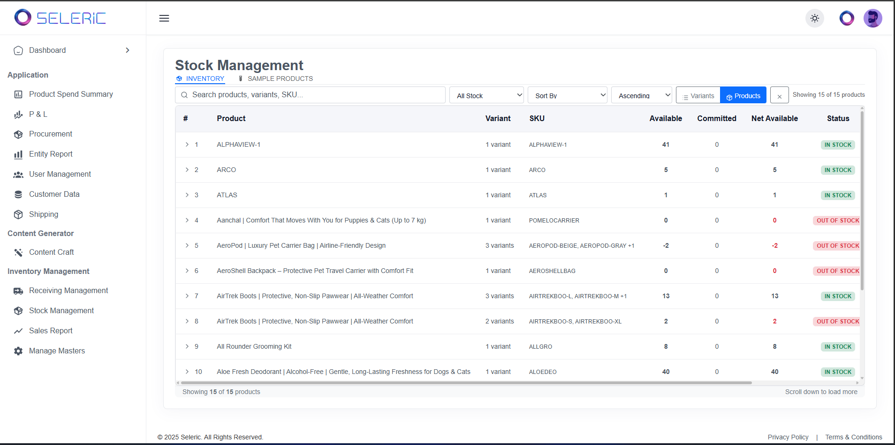
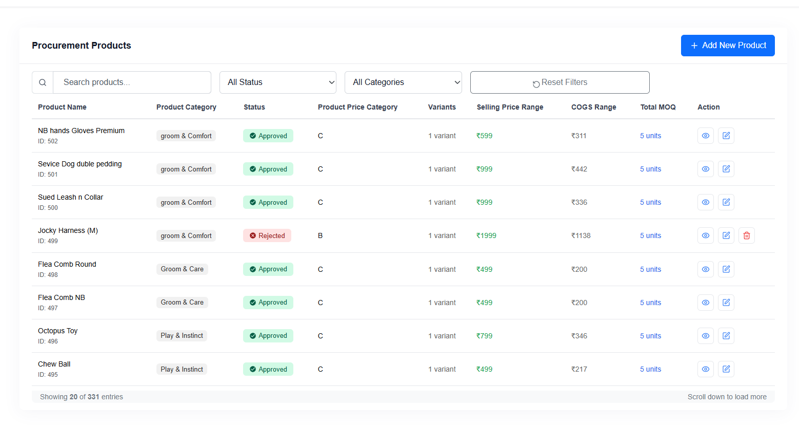
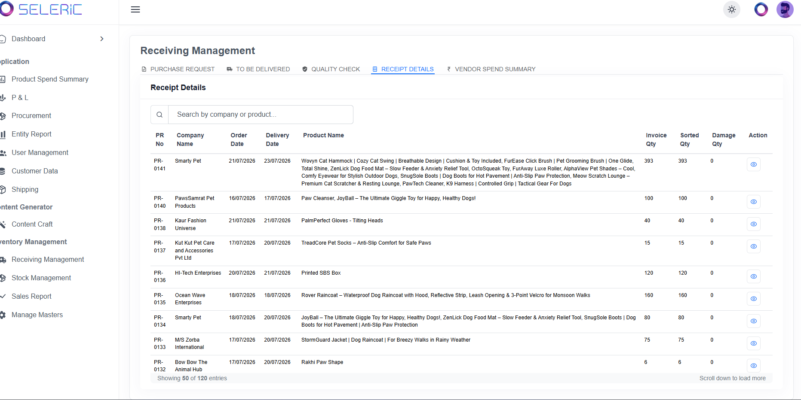

# Warehousing — Seleric Inventory & Procurement Suite

A full-stack operations dashboard for tracking inventory, procurement, and receiving across a product catalog, built on a Next.js admin UI with an Express/PostgreSQL API.

Live demo: frontend on Windsurf ([sku-management-webapp.windsurf.build](https://sku-management-webapp.windsurf.build)) · backend on Render ([warehousing-z9wl.onrender.com](https://warehousing-z9wl.onrender.com))


## What it does

The app (branded **Seleric**) is organized around a sidebar of operational modules:

- **Dashboard** — landing overview
- **Application**
  - **Product Spend Summary**
  - **P&L**
  - **Procurement** — searchable/filterable product list (status: Approved/Rejected, price category, variants, selling price, COGS, and MOQ), with view/edit/delete actions and an "Add New Product" flow
  - **Entity Report**
  - **User Management**
  - **Customer Data**
  - **Shipping**
- **Content Generator**
  - **Content Craft**
- **Inventory Management**
  - **Receiving Management** — Purchase Request, To Be Delivered, Quality Check, Receipt Details, and Vendor Spend Summary tabs; Receipt Details tracks PR number, company, order/delivery dates, invoiced/sorted/damaged quantities per product
  - **Stock Management** — searchable inventory table by product/variant/SKU, with stock-level and sort filters, showing available/committed/net-available quantities and in-stock/out-of-stock status
  - **Sales Report**
  - **Manage Masters**

A REST backend (Express + `pg`) persists records to PostgreSQL, with CRUD endpoints under `/product_metrics`.

## Tech stack

**Frontend** — Next.js 15 (App Router), React 18, Bootstrap 5 / Ant Design, Axios, react-toastify, react-modal, ApexCharts

**Backend** — Node.js, Express 5, `pg` (node-postgres), CORS, dotenv

**Database** — PostgreSQL (`product_metrics` table: `product_name`, `size`, `sku_name`, `selling_price`, `per_bottle_cost`, `net_margin`)

**Deployment** — Frontend on Windsurf/Netlify, backend on Render (see `netlify.toml` / `Procfile`)

## Project structure

```
Warehousing/
├── backend/
│   ├── server.js          # Express app: CORS, pg pool, /product_metrics CRUD routes
│   ├── .env.example        # DB_USER, DB_HOST, DB_NAME, DB_PASSWORD, DB_PORT, PORT
│   └── Procfile
└── frontend/
    └── src/
        ├── app/Sku-List/          # SKU management route
        ├── components/SkuTableDataLayer.jsx   # SKU table: search, sort, pagination, CRUD modal
        ├── api/api.js             # Axios client for the backend
        ├── config.js              # API base URL (env override or Render URL)
        └── masterLayout/          # Shared admin layout/sidebar
```

## Running it locally

**Backend**

```bash
cd backend
npm install
cp .env.example .env   # fill in a real Postgres connection
npm run dev             # nodemon, http://localhost:3001
```

You'll need a `product_metrics` table matching the columns above; the app doesn't ship a migration/schema file.

**Frontend**

```bash
cd frontend
npm install
npm run dev   # http://localhost:3000
```

Set `REACT_APP_API_BASE_URL` if the backend isn't running at the default (it falls back to the deployed Render URL).

## Screenshots

**Stock Management** — inventory table with search, stock-level/sort filters, and available/committed/net-available quantities per product/variant:



**Procurement** — product catalog with status, price category, variants, selling price/COGS ranges, and MOQ:



**Receiving Management** — receipt details by purchase request, tracking company, order/delivery dates, and invoiced/sorted/damaged quantities:


