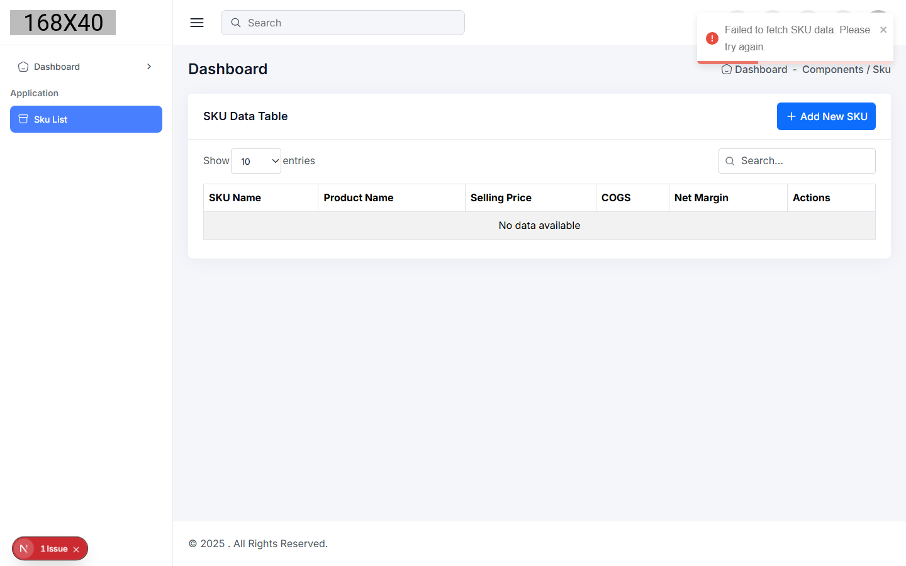
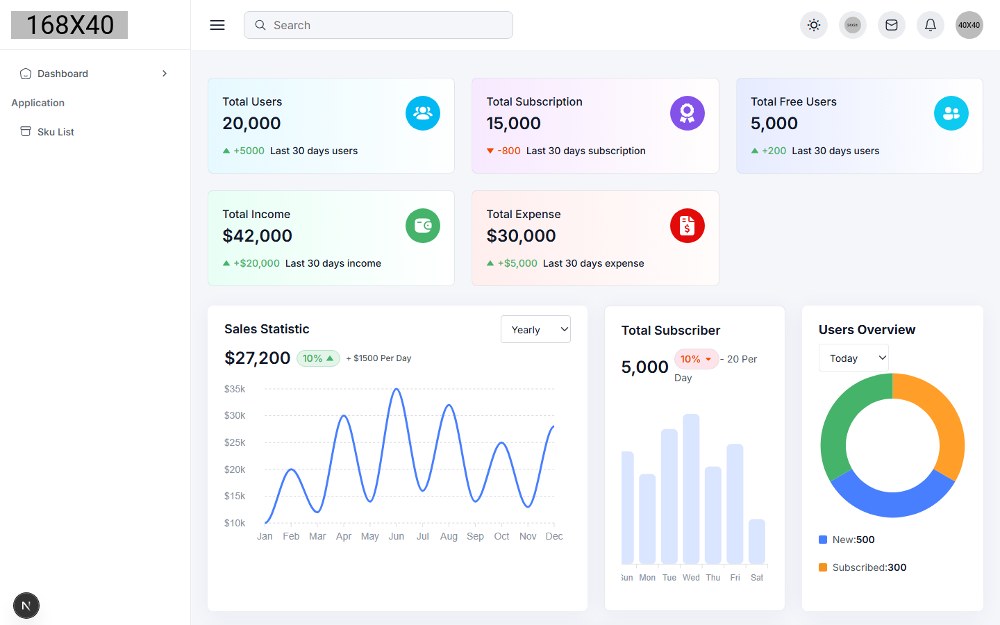

# Warehousing — SKU & Product Margin Manager

A full-stack CRUD app for tracking product SKUs and per-unit profit margins, built on a Next.js admin dashboard with an Express/PostgreSQL API.

Live demo: frontend on Windsurf ([sku-management-webapp.windsurf.build](https://sku-management-webapp.windsurf.build)) · backend on Render ([warehousing-z9wl.onrender.com](https://warehousing-z9wl.onrender.com))

## What it does

The core feature is the **SKU List** page: a data table for managing product SKUs with their selling price, per-bottle cost, and net margin (auto-calculated as selling price − cost). It supports:

- Create / edit / delete SKUs through a modal form, with a confirmation step before delete
- Client-side search across all columns and sortable columns
- Pagination with configurable page size
- Toast notifications for success/failure on every API call
- A REST backend (Express + `pg`) persisting SKU records to PostgreSQL, with the usual CRUD endpoints under `/product_metrics`

Everything else in the `frontend/` app (dashboard widgets, invoices, kanban, chat, calendar, form components, etc.) comes from the open-source Next.js admin dashboard template this project was scaffolded from — those routes exist in the codebase but aren't wired into the app's sidebar navigation and aren't part of the actual product. The template's default dashboard (with placeholder "Total Users" / "Total Subscription" stats) is still the home page.

## Tech stack

**Frontend** — Next.js 15 (App Router), React 18, Bootstrap 5 / Ant Design, Axios, react-toastify, react-modal, ApexCharts (unused by the SKU feature, part of the template)

**Backend** — Node.js, Express 5, `pg` (node-postgres), CORS, dotenv

**Database** — PostgreSQL (`product_metrics` table: `product_name`, `size`, `sku_name`, `selling_price`, `per_bottle_cost`, `net_margin`)

**Deployment** — Frontend on Windsurf/Netlify, backend on Render (see `netlify.toml` / `Procfile`)

## Project structure

```
Warehousing/
├── backend/
│   ├── server.js          # Express app: CORS, pg pool, /product_metrics CRUD routes
│   ├── .env.example        # DB_USER, DB_HOST, DB_NAME, DB_PASSWORD, DB_PORT, PORT
│   └── Procfile
└── frontend/
    └── src/
        ├── app/Sku-List/          # The SKU management route
        ├── components/SkuTableDataLayer.jsx   # SKU table: search, sort, pagination, CRUD modal
        ├── api/api.js             # Axios client for the backend
        ├── config.js              # API base URL (env override or Render URL)
        └── masterLayout/          # Shared admin layout/sidebar (from the WowDash template)
```

## Running it locally

**Backend**

```bash
cd backend
npm install
cp .env.example .env   # fill in a real Postgres connection
npm run dev             # nodemon, http://localhost:3001
```

You'll need a `product_metrics` table matching the columns above; the app doesn't ship a migration/schema file.

**Frontend**

```bash
cd frontend
npm install
npm run dev   # http://localhost:3000
```

Set `REACT_APP_API_BASE_URL` if the backend isn't running at the default (it falls back to the deployed Render URL). Navigate to `/Sku-List` for the actual feature — the home page (`/`) is the template's default demo dashboard.

## Screenshots

**SKU List** — search, sort, pagination, and add/edit/delete for product SKUs (shown here with no backend connected, hence the empty-state toast):



**Default dashboard** — unmodified WowDash template landing page:




